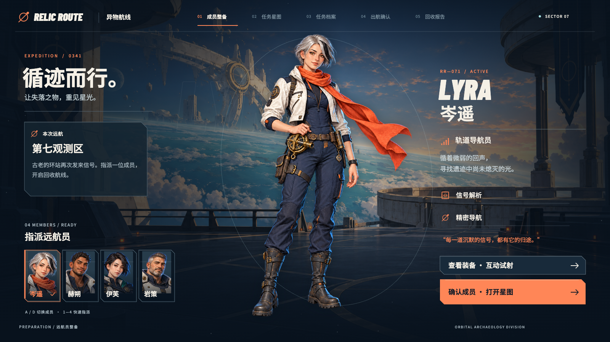

# 异物航线 · RELIC ROUTE

以角色与装备反馈为中心的原创科幻游戏 UI 与动效概念作品。指派四位远航员，选择异常信号，阅读任务并确认出航，最后识别与领取遗物；也可进入独立装备试验台，比较四种武器的释放与命中效果。

**[在线作品展示](https://rheeh.github.io/relic-route/)** · **[可交互原型](demo/index.html)** · **[40 秒流程影片](showcase/film.mp4?v=3.0.0)** · **[v3 完整作品包](https://github.com/rheeh/relic-route/releases/download/v3.0.0/relic-route.zip)**



## Goal · 目标

让角色、美术构图与操作反馈共同组织一段可以亲手体验的游戏界面流程：玩家看清所选成员和任务，完成确认，并得到明确的奖励反馈。装备试验台补充四种释放方式的可操作比较。

项目是自发概念设计，主任务保留成员整备至遗物领取的五步流程，装备试验台通过整备页的独立入口进入。任务、风险、周期与奖励属于世界观演示；确认后直接进入回收报告，无需等待设定中的作业周期。试射提供图形与声音反馈，不包含敌人 AI、伤害判定、战斗、角色养成、服务器或真实存档；没有开展用户测试与用户研究。

## Hypothesis · 假设

人物成为整备页的视觉中心，任务页建立地点与目标的对应，奖励页集中展示发现；通过不同构图、分层视差和分段入场，可以让连续操作同时具有角色身份和视觉节奏。每段演出结束后保留清楚的阅读态与主动作。

这是本轮设计假设，不将制作完成或原型可运行解释为可用性已经得到验证。

## Variables · 设计变量

色彩以骨白、墨蓝和珊瑚橙为主，青色用于观测光与次要信号。角色、环境、遗物是独立的二维美术素材；细线、截角、航线与扫描图形由程序绘制。

| 画面与动作 | 当前设计方式 |
| --- | --- |
| 成员整备 | 四位远航员采用不同轮廓、职能与人物文案；全身主图配合头肩选择卡，切换以约 560 ms 的位移、淡入和光线交接呈现 |
| 装备试验台 | 四种程序绘制的武器分别使用同心脉冲、磁轨穿刺、折线电束和新月冲击；支持普通试射、约 1 秒蓄能、命中反馈与冷却期间的按钮禁用 |
| 任务星图 | 三个地点与任务摘要对应；节点括角、航线和局部信号表达当前选择，目标、风险、周期与遗物同步更新 |
| 任务档案 | 任务说明、回收步骤、遗物大图与所选成员的简报分区呈现 |
| 出航确认 | 所选成员、目的地、周期和回收目标集中核对；保留返回入口，主动作确认航线 |
| 遗物揭示与领取 | 扫描线和自上而下展开的矩形遮罩在 1600 ms 内揭示遗物；领取后显示已入库，主入口转为返回星图 |
| 连续过渡 | 约 720 ms 的斜向擦入承接界面，信息分段到达；环境与美术使用轻微视差和整体微动 |

本轮同时改变角色、美术素材、色彩、排版与动效。与旧版的对照用于呈现整体视觉方向差别，不是单变量实验，不据此判断某一因素独立造成了效果提升。

## Result · 当前实现

- 五个界面连续可操作：成员整备、任务星图、任务档案、出航确认、回收报告。
- 四位成员可选择，人物、职能、简报、装备和结算中的成员信息随选择更新。
- 独立装备试验台可切换四种装备，提供普通试射、蓄能释放、训练靶命中、试射计数和冷却反馈。点击训练靶也可触发普通试射。
- 三个任务分别对应航行铭牌、同心环光核与观测铜环，任务目标、风险和周期随选择更新。
- 回收报告包含等待识别、识别中、已识别和已入库状态；识别期间按钮禁用，领取后移除领取入口。
- 原型支持鼠标、Tab / Enter 与快捷键，可返回整备、星图或任务档案。
- 减少动态效果模式简化过渡、环境运动与扫描等待；装备台立即呈现稳定的命中关键帧，省略后坐、闪光和移动粒子。首次载入采用系统偏好，也可手动切换。
- 40 秒演出与交互原型共用 Canvas 画面，支持暂停、重播和时间定位。

| 成员 | 职能 | 固定对应装备 |
| --- | --- | --- |
| 岑遥 · LYRA | 轨道导航员 | 弧光脉冲器 |
| 赫朔 · ORION | 遗物工程师 | 磁轨锚枪 |
| 伊芙 · EVE | 深空侦察员 | 折线脉冲枪 |
| 岩策 · ROOK | 重装先锋 | 相位盾刃 |

视觉实现由生成的角色、环境与三件遗物二维栅格图，加上 Canvas 图形、位移、遮罩、光效和视差组成。装备台的武器、靶场、蓄能、弹道与命中效果均由 Canvas 2D 绘制，没有使用生成的武器图片或三维模型。人物只有整体微动与切换，没有 Live2D、三维角色或骨骼动画；对白是界面文字，没有角色配音。

## Showcase · 展示

[作品展示页](index.html)提供流程影片、五步界面、四位成员、装备试验台、动效示意与旧版对照。[交互原型](demo/index.html)可自行选择成员和任务；[独立装备入口](demo/index.html?screen=armory)可直接试射；[影片模式](demo/index.html?film=1)播放固定编排的 40 秒演出。

| 界面 | 1600 × 900 关键帧 |
| --- | --- |
| 成员整备 | [00-crew.png](showcase/00-crew.png) |
| 任务星图 | [01-map.png](showcase/01-map.png) |
| 任务档案 | [02-dossier.png](showcase/02-dossier.png) |
| 出航确认 | [03-confirm.png](showcase/03-confirm.png) |
| 奖励揭示与领取 | [04-reward.png](showcase/04-reward.png) |
| 独立装备试验台 | [05-armory.png](showcase/05-armory.png) |

奖励关键帧是已识别、待领取状态；已入库反馈在原型和影片中呈现。历史对照保留[旧星图](showcase/before/01-map-v1.png)和[旧奖励页](showcase/before/04-reward-v1.png)，不代替当前版本。

影片节奏：0–8 秒成员整备（2 秒伊芙、4 秒岩策、6 秒赫朔）；8–19 秒四种装备试射；19 秒星图（21 秒铜蚀残带、23 秒静默环站）；24 秒任务档案；28 秒出航确认；31 秒回收报告；32–33.6 秒扫描；36 秒领取；38–40 秒片尾。完整声音与武器释放节点见[素材与音轨记录](demo/assets/prompts.md#音轨)。

## 打开与运行

普通浏览无需 Node.js、依赖安装或构建。进入本实验目录，用 Python 3 启动本地服务：

```sh
python3 scripts/serve.py
```

访问 <http://127.0.0.1:4198/> 查看作品页，访问 <http://127.0.0.1:4198/demo/> 体验原型。项目也可部署到普通静态网站托管服务，运行素材、字体和代码均在实验目录内。

原型按 PC 16:9、1600 × 900 设计。手机可在响应式作品页阅读案例、观看影片与界面图；操作原型建议使用桌面浏览器，手机可横屏观看。

- 成员整备与装备试验台：点击角色或装备卡，或用 A / D、左右方向键、1–4 切换成员与对应装备。
- 装备试验台：点击训练靶或“普通试射”，也可按空格试射；点击“蓄能释放”或按 Shift + 空格触发蓄能。反馈演出与冷却期间，试射入口暂时禁用。
- 任务星图：点击任务卡或节点，或用 1–3 选择任务。
- Tab / Enter 操作可用按钮；Esc 返回上一层或退出影片。
- 页面下方可切换声音与减少动态效果；影片控制栏支持暂停、重播和时间定位。

## 文件与再导出

```text
index.html          作品展示入口
demo/               可交互原型、字体与美术素材
showcase/           六张界面图、流程影片与旧版对照
design/             原作者参考与设计依据
scripts/            本地预览、字体子集和媒体导出
```

[参考研究](design/references.md)记录四位作者的来源、核看范围与本项目采用方式；[素材导航](demo/assets/prompts.md)记录生成素材、提示词与音轨。

主流程、成员状态和影片时序位于 [demo/app.js](demo/app.js)；装备、靶场与 VFX 绘制位于 [demo/weapons.js](demo/weapons.js)。原角色提示词见[岑遥与赫朔](demo/assets/characters/prompts.md)，新增角色分别见[伊芙](demo/assets/characters/eve-prompt.md)与[岩策](demo/assets/characters/rook-prompt.md)。

在本地服务中打开 `/demo/?studio=1`，展开页面下方“作品导出工具”，可保存六张 1600 × 900 固定界面图或录制 40 秒演出。录制时保持浏览器可见；中间录像和音轨保存在 `output/`，公开影片位于 `showcase/film.mp4`。

```sh
python3 scripts/synthesize-audio.py
sh scripts/encode-film.sh
python3 scripts/package.py
```

音频合成使用 Python 标准库；MP4 编码需要 ffmpeg。仅在修改文案、加入新汉字时需要重新生成字体子集，制作脚本需要 fontTools 与 Brotli。普通浏览无需这些制作工具。

## 素材与署名

- 四位角色、整备甲板环境、三处任务目的地场景和三件遗物图集以 Codex 内置 `image_gen` 生成，是本项目的 AI 辅助概念美术，不宣称手绘制作。任务档案另使用本实验此前生成的观测环背景。实际提示词与透明素材说明见[素材导航](demo/assets/prompts.md)。
- 界面布局、文字、标志、图标、地图、按钮状态、装备图形、靶场、光效、交互与 Canvas 动效为本项目制作。背景、人物与程序图形按图层组合，不将二维 PNG 称作独立肢体动画。立绘中持有的装备属于生成的角色图像，试验台中的装备预览与释放效果由代码单独绘制。
- UI 音效与 40 秒影片音轨为程序合成，无外部音乐、采样或角色语音。
- 当前参考为 [Daanish Syed 的 MK11](https://www.daanishsyed.com/mk11)、[Taylor Buck 的科幻装备 UI](https://taylor_buck.artstation.com/projects/Pmk8wB)、[takayuP4 的教程](https://gameanimation.info/en/archives/5601)与 [Náthaly Moyano 的 The Mother](https://nathalymoyano.com/work-themother)。借鉴构图、层次与动效组织，未复制或打包外部角色、截图、图标和视频。已看的静态构图与作者文字说明分别记录在[参考研究](design/references.md)。
- [Barlow Condensed](https://github.com/google/fonts/tree/main/ofl/barlowcondensed)与 [Noto Sans SC](https://github.com/google/fonts/tree/main/ofl/notosanssc)使用 SIL OFL 1.1。中文 WOFF2 子集保留可变字重，内部家族名为 Relic Sans SC；许可文件位于 `demo/assets/fonts/`。

代码使用 MIT 许可，字体保留各自 OFL。源码仓库为 [rheeh/relic-route](https://github.com/rheeh/relic-route)，作品包包含展示页、原型、影片、素材与制作脚本。
