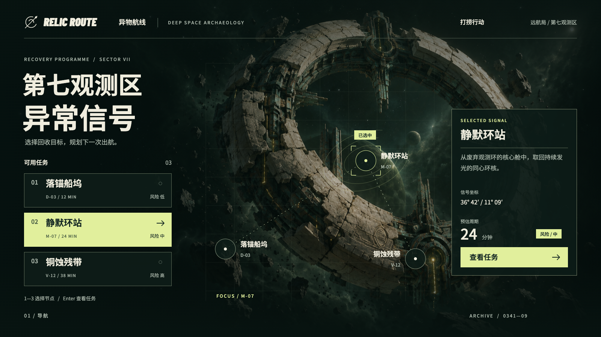

# 异物航线 · RELIC ROUTE

深空考古题材的原创游戏 UI 与动效概念作品。玩家选择一处异常信号，阅读回收目标与风险，确认航线，再识别和领取遗物。

**[在线作品展示](https://rheeh.github.io/relic-route/)** · **[可交互原型](demo/index.html)** · **[30 秒流程影片](showcase/film.mp4)** · **[完整作品包](https://github.com/rheeh/relic-route/releases/download/v1.0.0/relic-route.zip)**



## Goal · 目标

让玩家在任务选择、出发确认和奖励领取中，始终知道当前目标、下一步动作和操作结果。作为游戏 UI 与动效作品，展示完整界面构图、信息层级、操作状态和连续转场。

这是自发概念项目。任务和奖励为世界观演示内容，不包含战斗、服务器或真实存档；作业周期是设定，不需要实际等待。没有开展用户研究，不将原型演示当成可用性研究结果。

## Hypothesis · 假设

聚焦让选择变清楚，展开让层级有来处，显影让奖励的发现有节奏。每段动效结束后进入可阅读的静止态，按钮和正文保持稳定，玩家可以自行决定下一步。

## Variables · 设计变量

| 动作 | 设计方式 | 节奏 |
| --- | --- | --- |
| 选择任务 | 节点括角、局部环线聚拢，任务摘要同步更新 | 220 ms |
| 星图与任务详情 | 信息面板从选中节点展开；返回沿相反方向收回 | 440 ms |
| 确认出发 | 对照目标、风险与周期，按钮按下立即改变色阶 | 440 ms 转场 |
| 识别遗物 | 局部不规则显影遮罩与扫描线揭示遗物 | 900 ms |
| 领取奖励 | 名称和物品保持可读，动作入口切换为返回星图，显示已入库 | 立即反馈 |

色彩采用深墨绿空间、暖白档案面板与酸黄操作重点。观测环、同心结构和截角图形贯穿任务、档案与奖励界面。

## Result · 当前实现

- 三个任务可选择，目标、风险、周期和遗物随任务更新。
- 四个关键界面可连续操作，支持返回星图、返回任务和出发前修改。
- 奖励包含封存、识别中、已识别、已入库状态。识别期间按钮禁用，领取后移除领取入口。
- 键盘可通过 Tab / Enter 操作；星图支持 1–3 选择，Esc 返回上一层。
- 可切换减少动态效果和合成 UI 音效。系统减少动态效果偏好会在首次载入时采用。
- 30 秒演出支持暂停、重播和时间定位，与交互原型共用 Canvas 画面和动效时序。

## Showcase · 展示

展示页提供完整影片、四张原生界面图、可重播的动效规范示意，以及项目范围和素材职责说明。

| 界面 | 关键帧 |
| --- | --- |
| 任务星图 | [1600 × 900](showcase/01-map.png) |
| 任务详情 | [1600 × 900](showcase/02-dossier.png) |
| 出发确认 | [1600 × 900](showcase/03-confirm.png) |
| 奖励揭示与领取 | [1600 × 900](showcase/04-reward.png) |

奖励关键帧是“已识别、待领取”状态；已入库反馈在原型和流程影片中呈现。

## 打开与运行

无需 Node.js、依赖安装或构建。使用 Python 3 启动本地服务：

```sh
python3 scripts/serve.py
```

访问 <http://127.0.0.1:4198/> 查看作品页，访问 <http://127.0.0.1:4198/demo/> 体验原型。也可将项目静态文件放入普通静态网站托管服务。

游戏原型面向 PC 16:9 界面，原生画面为 1600 × 900。手机建议横屏，或在响应式作品页观看影片与界面图。所有运行素材、字体和代码都在本项目中，不请求外部素材。

## 文件与再导出

```text
index.html          作品展示入口与设计拆解
demo/               原型、字体和概念美术
showcase/           关键帧、影片与展示页样式
scripts/            本地预览、字体子集和媒体导出
```

在本地服务中打开 `/demo/?studio=1`，展开页面下方“作品导出工具”，可保存四张界面图或录制 30 秒演出。录制时保持浏览器可见，不切换页面。中间素材写入 `output/`，不属于公开展示入口。

```sh
python3 scripts/synthesize-audio.py
sh scripts/encode-film.sh
python3 scripts/package.py
```

音频合成只使用 Python 标准库；MP4 编码需要 ffmpeg。字体子集仅在修改文案、需要加入新汉字时重新生成，脚本需要 fonttools 和 brotli，并接受原字库路径参数。普通浏览不需要这些制作工具。

## 素材与署名

- 界面布局、文字层级、标志图形、按钮状态、地图与扫描图形，以及交互和动效代码，为本项目制作。
- 深空观测环背景与透明同心环遗物使用内置 image_gen 工具生成；属于 AI 辅助概念美术，未宣称手绘。另两件遗物以程序图形绘制。实际提示词见 [素材记录](demo/assets/prompts.md)。
- UI 音效与影片音轨为程序合成，无外部采样。
- [Barlow Condensed](https://github.com/google/fonts/tree/main/ofl/barlowcondensed) 使用 SIL OFL 1.1；[Noto Sans SC](https://github.com/google/fonts/tree/main/ofl/notosanssc) 使用 SIL OFL 1.1。本项目的中文 WOFF2 子集保留 100–900 可变字重，内部家族重命名为 Relic Sans SC。原许可位于 `demo/assets/fonts/`。
- 视觉机制参考：[光线聚焦](https://x.com/artfclnoodles/status/2034294395864756304)、[平面与立体的展开](https://x.com/SinzVII/status/2042903252505936198)、[生成纹理](https://x.com/jasonwebb/status/1341182678922457089)。未打包原帖图片、视频或代码；本项目的扫描显影是自行实现的遮罩动效，不是反应扩散模拟。

代码使用 MIT 许可。字体保留各自 OFL；AI 辅助美术的来源在项目中明确标注。

源码仓库：[rheeh/relic-route](https://github.com/rheeh/relic-route)。下载包包含展示页、原型、影片、素材与制作脚本，解压后按上述命令运行。
